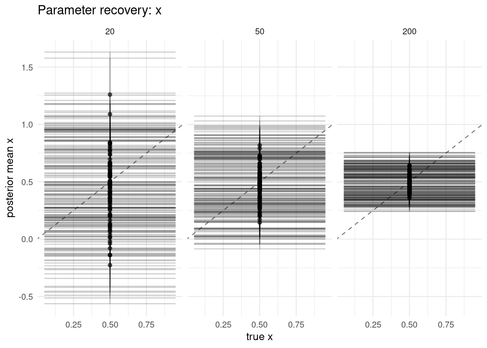

<!-- README.md is generated from README.Rmd. Please edit README.Rmd and run
     devtools::build_readme(). -->

# bayesim

<!-- badges: start -->

[](https://github.com/sims1253/bayesim/actions/workflows/R-CMD-check.yaml)
[](https://app.codecov.io/gh/sims1253/bayesim)
[](LICENSE)
[](https://lifecycle.r-lib.org/articles/stages.html#experimental)
<!-- badges: end -->

## Overview

**bayesim** is an R package for running simulation studies of Bayesian
models: parameter recovery, calibration checking via simulation-based
calibration (SBC), model comparison, and method evaluation.

A study is declared as a grid of data-generating conditions, models, and
replicates. bayesim expands the grid into tasks, executes them
(sequentially or in parallel, with checkpointing and bounded memory),
and summarizes the results as the performance measures recommended by
Morris, White, and Crowther (2019) — bias, empirical SE, MSE, and
coverage, each with its Monte Carlo standard error.

Main features:

  - Deterministic reproducibility: each task receives its own
    L’Ecuyer-CMRG RNG stream derived from a single study seed, so
    sequential, parallel, and resumed runs produce identical results.
  - Simulation-based calibration with prior-predictive and
    inverse-forward-sampling generators, ESS-aware rank thinning, and
    ECDF plots with simultaneous confidence bands (Säilynoja, Bürkner,
    and Vehtari, 2022).
  - Performance measures with Monte Carlo standard errors; LOO-based
    metrics follow their reference implementations in the loo and brms
    packages.
  - For brms studies, a model bank compiles each distinct Stan model
    once and reuses the binary across replicates.
  - Parallel execution via mirai, checkpoint/resume for long runs, and
    retention profiles to bound memory use.
  - Extensible fitters and metrics. The built-in
    `LinearRegressionFitter()` performs exact conjugate inference, so
    the documentation examples run without a Stan installation.

## Installation

bayesim is not yet on CRAN. Install the development version with:

``` r
# install.packages("pak")
pak::pak("sims1253/bayesim")
```

For brms- or Stan-backed studies you additionally need
[brms](https://paulbuerkner.com/brms/) and/or
[cmdstanr](https://mc-stan.org/cmdstanr/) with a working CmdStan
installation.

## Example

A small coverage study: does a 90% credible interval cover the truth 90%
of the time, and how does estimation error change with sample size?

``` r
library(bayesim)

# Data-generating function. The engine restores a per-task RNG stream before
# each call, so the function can simply consume the ambient RNG state.
gen <- function(data_spec, task_ctx) {
  x <- rnorm(data_spec$n)
  y <- 1 + 0.5 * x + rnorm(data_spec$n, sd = data_spec$sigma)
  list(
    train = data.frame(y = y, x = x),
    response = "y",
    true_params = c(Intercept = 1, x = 0.5, sigma = data_spec$sigma),
    vars_of_interest = c("Intercept", "x", "sigma")
  )
}

# 3 sample sizes x 1 model x 100 replicates = 300 tasks.
config <- simulation_config(
  data_grid = data.frame(n = c(20, 50, 200), sigma = 1),
  fit_grid = data.frame(model = "linear"),
  data_generator = gen,
  fitter = LinearRegressionFitter(), # exact conjugate posterior
  metrics = list(
    posterior_summary_metric(prob = 0.90),
    coverage_metric(prob = 0.90)
  ),
  n_replicates = 100L,
  seed = 42L
)

result <- run_simulation(config, workers = 2, progress = FALSE)
#> ℹ Starting simulation with 300 tasks

# Estimator performance with Monte Carlo standard errors.
performance_measures(result, by = "data_n")
#> # A tibble: 54 × 6
#>    data_n estimand  measure     value     mcse n_sim
#>     <dbl> <chr>     <chr>       <dbl>    <dbl> <int>
#>  1     20 Intercept bias      -0.0235  0.0239    100
#>  2     20 Intercept emp_se     0.239   0.0170    100
#>  3     20 Intercept mse        0.0573  0.00856   100
#>  4     20 Intercept model_se   0.204   0.00366   100
#>  5     20 Intercept coverage   0.83    0.0376    100
#>  6     20 Intercept n_sim    100      NA         100
#>  7     50 Intercept bias       0.0178  0.0125    100
#>  8     50 Intercept emp_se     0.125   0.00889   100
#>  9     50 Intercept mse        0.0158  0.00191   100
#> 10     50 Intercept model_se   0.137   0.00158   100
#> # ℹ 44 more rows
```

True parameter values are recorded per task, so parameter recovery can
be plotted directly:

``` r
plot_recovery(result, "x", by = "data_n")
```



Studies backed by brms or raw Stan programs use the same interface
through `BrmsFitter()` and `CmdStanFitter()`; see
`vignette("brms-studies")` and `vignette("custom-fitters")`. Calibration
checking is described in `vignette("sbc-and-calibration")`, and guidance
on designing studies (estimands, number of replicates, reporting) in
`vignette("design-of-simulation-studies")`.

## Related packages

bayesim is not the best fit for a purely frequentist simulation that
does not need posterior draws, SBC, LOO, or Stan-aware execution; use a
general-purpose framework such as SimDesign in that case.

  - [SimDesign](https://cran.r-project.org/package=SimDesign) and
    [simhelpers](https://cran.r-project.org/package=simhelpers) are
    general-purpose simulation frameworks. bayesim focuses on Bayesian
    workflows: posteriors, calibration, LOO, and Stan-aware execution
    are built in.
  - [rsimsum](https://cran.r-project.org/package=rsimsum) analyzes
    existing simulation results. bayesim runs the study and reports the
    same Morris et al. performance measures; its MCSE formulas follow
    rsimsum.
  - [SBC](https://hyunjimoon.github.io/SBC/) implements calibration
    checking. bayesim provides SBC as one metric within a general study
    engine.

## Getting help

Bug reports and feature requests:
[github.com/sims1253/bayesim/issues](https://github.com/sims1253/bayesim/issues).

## References

  - Morris TP, White IR, Crowther MJ (2019). Using simulation studies to
    evaluate statistical methods. *Statistics in Medicine*, 38(11),
    2074-2102.
  - Talts S, Betancourt M, Simpson D, Vehtari A, Gelman A (2018).
    Validating Bayesian inference algorithms with simulation-based
    calibration. arXiv:1804.06788.
  - Säilynoja T, Bürkner PC, Vehtari A (2022). Graphical test for
    discrete uniformity and its applications in goodness-of-fit
    evaluation. *Statistics and Computing*, 32(2).
  - Vehtari A, Gelman A, Gabry J (2017). Practical Bayesian model
    evaluation using leave-one-out cross-validation and WAIC.
    *Statistics and Computing*, 27(5), 1413-1432.
