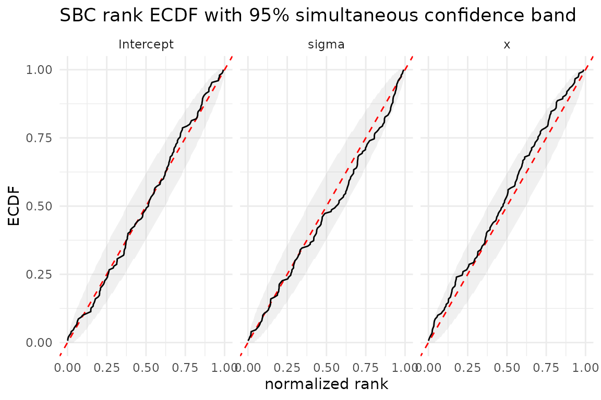
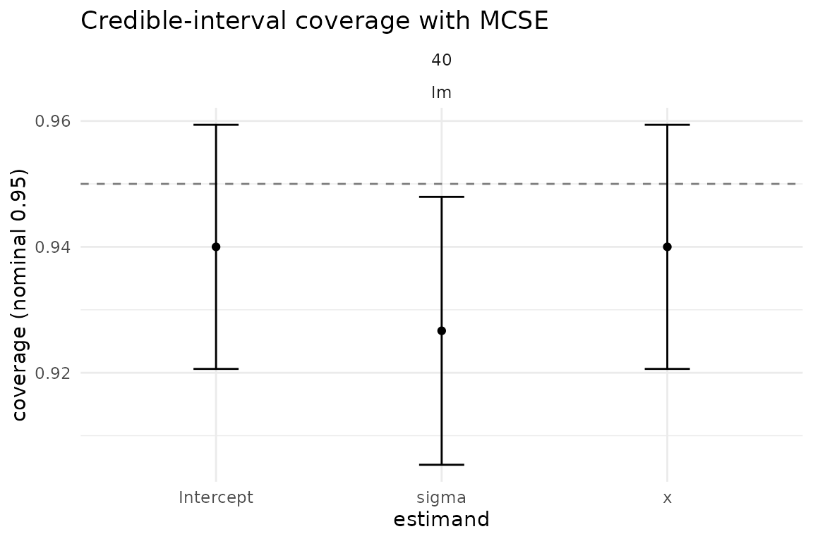

# SBC and calibration

``` r

library(bayesim)
```

## Introduction

Simulation-based calibration (SBC) checks Bayesian inference against
data generated from the model (Talts et al., 2018):

> If we draw a parameter `theta` from the model prior, simulate data `y`
> from the likelihood given `theta`, and then fit the model to `y`, the
> resulting rank of `theta` among independent posterior draws should be
> uniform across repeated simulations.

Equivalently, the **posterior rank** of the true `theta` among the
posterior draws should be uniformly distributed on `{0, 1, ..., S}`.
Departures can indicate errors in inference or in the simulation setup.

The coverage guarantee averages over parameters drawn from the prior and
data drawn from the likelihood. It does not guarantee nominal coverage
at each fixed parameter value. Rank checks can detect errors that a
check of one credible interval misses, but passing SBC does not
establish that an inference algorithm is correct.

This vignette uses
[`LinearRegressionFitter()`](https://sims1253.github.io/bayesim/reference/LinearRegressionFitter.md)
for exact conjugate Normal-Inverse-Gamma Bayesian linear regression
without Stan. For Stan/brms models, swap the fitter for
[`BrmsFitter()`](https://sims1253.github.io/bayesim/reference/BrmsFitter.md)
or
[`CmdStanFitter()`](https://sims1253.github.io/bayesim/reference/CmdStanFitter.md)
and use
[`prior_predictive_generator()`](https://sims1253.github.io/bayesim/reference/prior_predictive_generator.md)
/
[`ifs_generator()`](https://sims1253.github.io/bayesim/reference/ifs_generator.md);
the SBC workflow below is identical. One caveat:
[`prior_predictive_generator()`](https://sims1253.github.io/bayesim/reference/prior_predictive_generator.md)
draws theta from the model prior (valid SBC by construction when the
fitting prior matches), but
[`ifs_generator()`](https://sims1253.github.io/bayesim/reference/ifs_generator.md)
draws theta from a preconditioning posterior, so its ranks are only
uniform if the fitting prior is set to match that preconditioning
distribution. An unmatched fitting prior can produce nonuniform ranks
without a sampler error (see
[`?ifs_generator`](https://sims1253.github.io/bayesim/reference/ifs_generator.md)).

## Running SBC

The SBC recipe needs three ingredients:

1.  A **data generator** that draws `theta` from the model prior and
    simulates `y ~ p(y | theta)`.
2.  A **fitter** whose calibration we want to check.
3.  The **rank metric**
    ([`rank_metric()`](https://sims1253.github.io/bayesim/reference/RankMetric.md)),
    which counts how many posterior draws fall below the true `theta`,
    giving one rank per task per parameter.

Below, the generator draws `(Intercept, slope, sigma)` from exactly the
same Normal-Inverse-Gamma prior passed to
[`LinearRegressionFitter()`](https://sims1253.github.io/bayesim/reference/LinearRegressionFitter.md),
then simulates Gaussian linear data. In an NIG prior the coefficient
distribution is conditional on the residual variance:
`beta | sigma^2 ~ Normal(0, sigma^2 Lambda^-1)`. Matching that
conditional prior is essential; a prior mismatch is itself a valid SBC
failure mode. Because the fitter is the exact conjugate updater for this
same prior, SBC should pass by construction.

``` r

sbc_generator <- function(data_spec, task_ctx) {
  n <- data_spec$n
  # Exact NIG prior used by the fitter below:
  # sigma^2 ~ Inv-Gamma(2, 1)
  # beta | sigma^2 ~ Normal(0, sigma^2 / 0.25)
  sigma     <- sqrt(1 / stats::rgamma(1, shape = 2, rate = 1))
  intercept <- stats::rnorm(1, mean = 0, sd = sigma / sqrt(0.25))
  slope     <- stats::rnorm(1, mean = 0, sd = sigma / sqrt(0.25))
  # Simulate y from the likelihood given theta.
  x <- stats::rnorm(n)
  y <- intercept + slope * x + stats::rnorm(n, sd = sigma)
  list(
    train = data.frame(y = y, x = x),
    test = NULL,
    response = "y",
    true_params = c(Intercept = intercept, x = slope, sigma = sigma),
    vars_of_interest = c("Intercept", "x", "sigma")
  )
}
```

The data generator uses the current RNG state. bayesim restores a
per-task L’Ecuyer stream before each call, so do not call
[`set.seed()`](https://rdrr.io/r/base/Random.html) inside (see
[`vignette("reproducibility")`](https://sims1253.github.io/bayesim/articles/reproducibility.md)).

Now configure and run the study. We use 150 replicates and 1000
posterior draws per fit, with `rank_metric(thin = "auto")` so the rank
counts are adjusted for autocorrelation in the draws (here the NIG draws
are i.i.d., so no thinning is needed, but the option is there for
MCMC-based fitters).

``` r

config <- simulation_config(
  data_grid = data.frame(n = 40L),
  fit_grid = data.frame(model = "lm"),
  data_generator = sbc_generator,
  fitter = LinearRegressionFitter(
    n_draws = 1000L,
    prior_mean = 0,
    prior_precision = 0.25,
    a0 = 2,
    b0 = 1
  ),
  metrics = list(
    rank_metric(thin = "auto"),
    posterior_summary_metric()
  ),
  n_replicates = 150L,
  seed = 7L
)

result <- run_simulation(config, progress = FALSE)
#> 150 tasks = 1 data x 1 fit x 150 reps
#> ℹ Starting simulation with 150 tasks
#> 
#> ✔ Simulation complete: 150/150 tasks succeeded in 1.5s
```

Each task records one rank per parameter (here `Intercept`, `x`,
`sigma`), plus the posterior summaries needed for the coverage check
below.

## Checking rank uniformity

[`sbc_ranks()`](https://sims1253.github.io/bayesim/reference/sbc_ranks.md)
collects the per-task ranks into a long tibble;
[`plot_rank_ecdf()`](https://sims1253.github.io/bayesim/reference/plot_rank_ecdf.md)
plots the empirical CDF of the normalized ranks against the uniform CDF
(the diagonal), with the simultaneous uniformity band of Säilynoja,
Bürkner, and Vehtari (2022).

``` r

ranks <- sbc_ranks(result)
head(ranks)
#>                      task_id     param rank n_draws n_ranks data_n fit_model
#> Intercept.1 d001_f001_r00001 Intercept  920    1000    1001     40        lm
#> Intercept.2 d001_f001_r00002 Intercept  148    1000    1001     40        lm
#> Intercept.3 d001_f001_r00003 Intercept  680    1000    1001     40        lm
#> Intercept.4 d001_f001_r00004 Intercept  254    1000    1001     40        lm
#> Intercept.5 d001_f001_r00005 Intercept  826    1000    1001     40        lm
#> Intercept.6 d001_f001_r00006 Intercept  902    1000    1001     40        lm
```

``` r

plot_rank_ecdf(ranks, alpha = 0.95)
```



The red diagonal is the uniform CDF. The grey ribbon is a 95%
simultaneous band: for independent uniform ranks on a common support,
the whole ECDF stays inside it in about 95% of repetitions. This level
applies to each panel separately. A crossing can occur by chance even
with exact inference.

If condition cells share truth draws, their ranks are dependent. Pooling
them can make the band too narrow. Use `by` to separate the conditions,
for example `plot_rank_ecdf(result, by = c("data_n", "fit_model"))` when
those columns identify the cells. The band does not correct for
dependence from shared draws
([\#59](https://github.com/sims1253/bayesim/issues/59)). It is also
approximate when ranks within a panel have different supports.

## Interpreting departures

The shape can suggest a cause, but does not identify it uniquely:

| ECDF relative to the diagonal | Possible explanation |
|----|----|
| Above on the left, below on the right | Posterior uncertainty is too small. |
| Below on the left, above on the right | Posterior uncertainty is too large. |
| Mostly above | Posterior estimates tend to exceed the truth. |
| Mostly below | Posterior estimates tend to fall below the truth. |

Check the generator, model, and sampler diagnostics before attributing a
departure to the inference method. More replicates improve the ability
to detect small departures.

## Coverage as a complementary check

SBC checks the *whole* posterior at once. A complementary, more familiar
check is **interval coverage**: does the nominal 95% credible interval
contain the truth about 95% of the time?
[`plot_coverage()`](https://sims1253.github.io/bayesim/reference/plot_coverage.md)
shows this per estimand with MCSE error bars;
[`performance_measures()`](https://sims1253.github.io/bayesim/reference/performance_measures.md)
reports the same quantity in a table. Because SBC draws a new truth from
the prior for every replicate, this is a **varying-truth** study.
Accordingly, the table labels error summaries as `mean_error`,
`error_sd`, and `error_mse`; it does not label them as the fixed-truth
Morris measures `bias`, `emp_se`, or `mse`.

``` r

plot_coverage(result)
```



``` r

pm <- performance_measures(result, estimand = "x")
pm
#> # A tibble: 6 × 8
#>   data_n fit_model estimand measure       value     mcse n_sim truth_mode
#>    <int> <chr>     <chr>    <chr>         <dbl>    <dbl> <int> <chr>     
#> 1     40 lm        x        mean_error   0.0209  0.0122    150 varying   
#> 2     40 lm        x        error_sd     0.150   0.00869   150 varying   
#> 3     40 lm        x        error_mse    0.0228  0.00396   150 varying   
#> 4     40 lm        x        model_se     0.140   0.00441   150 varying   
#> 5     40 lm        x        coverage     0.94    0.0194    150 varying   
#> 6     40 lm        x        n_sim      150      NA         150 varying
```

The `coverage` row reports the empirical coverage of the 95% posterior
interval for the `x` coefficient, with its Monte Carlo standard error.
For the conjugate fitter this should sit close to the nominal 0.95
(within a couple of MCSEs). The `truth_mode` column is `"varying"`. Here
`mean_error` is the average replicate-level difference
`estimate - truth`, and its MCSE is computed from those replicate-level
errors; `error_sd` describes the spread of that error distribution.
These are useful calibration summaries, but they are not the empirical
sampling SE or bias of an estimator at one fixed truth.

Coverage checks one interval level. Rank uniformity checks calibration
over a range of posterior quantiles for the quantities supplied to
[`rank_metric()`](https://sims1253.github.io/bayesim/reference/RankMetric.md).
Neither check proves that every aspect of the joint posterior is
correct. Use a fixed-truth generator when you want the
estimator-performance measures `bias`, `emp_se`, and `mse`.

## Further reading

- Talts et al. (2018), *Validating Bayesian Inference Algorithms with
  Simulation-Based Calibration*, arXiv:1804.06788.
- Säilynoja, Bürkner, and Vehtari (2022), *Graphical test for discrete
  uniformity and its applications in goodness-of-fit evaluation*,
  *Statistics and Computing* 32(2).
- [`vignette("design-of-simulation-studies")`](https://sims1253.github.io/bayesim/articles/design-of-simulation-studies.md)
  for the Morris, White & Crowther
  2019. framework for designing and reporting simulation studies.
- [`vignette("reproducibility")`](https://sims1253.github.io/bayesim/articles/reproducibility.md)
  for the determinism guarantees behind SBC rank reproducibility.
