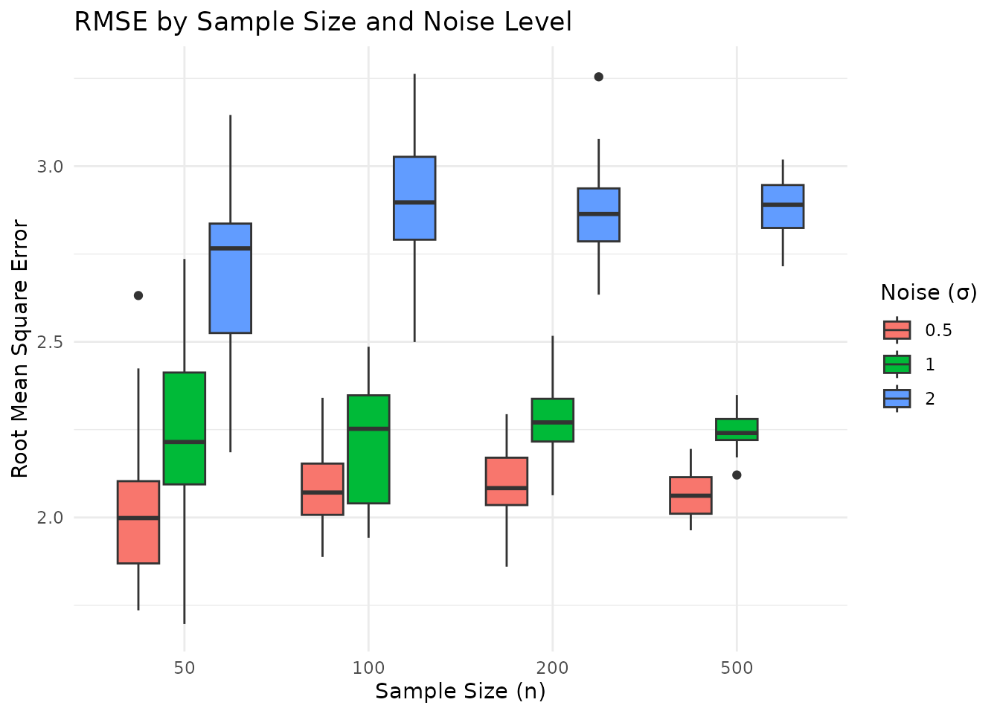
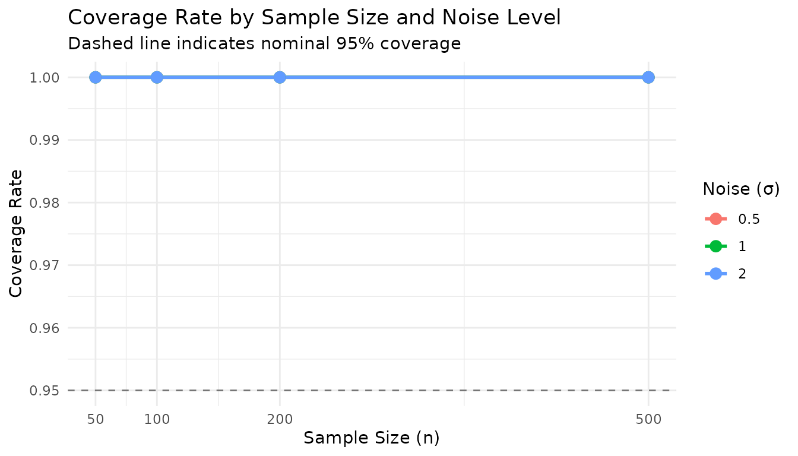
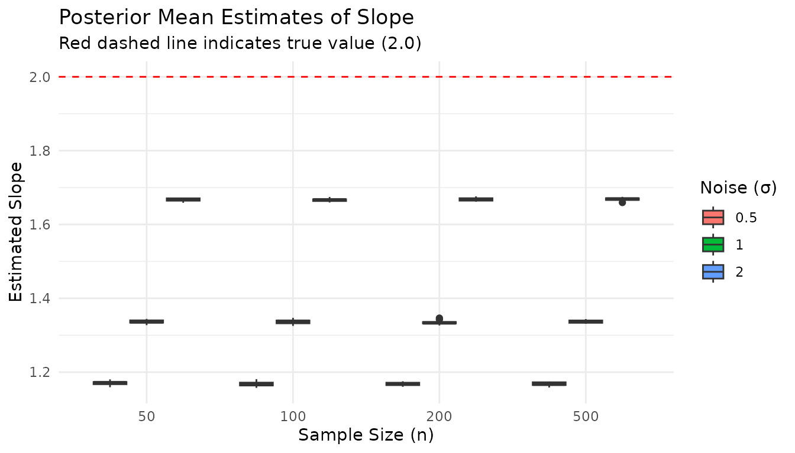

# Simulation Study Example: Assessing Model Performance

``` r
library(bayesim)
library(dplyr)
#> 
#> Attaching package: 'dplyr'
#> The following object is masked from 'package:bayesim':
#> 
#>     compute
#> The following objects are masked from 'package:stats':
#> 
#>     filter, lag
#> The following objects are masked from 'package:base':
#> 
#>     intersect, setdiff, setequal, union
library(ggplot2)
```

## Introduction

Simulation studies help us understand how statistical models perform
under controlled conditions. By systematically varying data
characteristics and measuring estimation accuracy, we identify scenarios
where models excel or struggle. This vignette demonstrates how to
conduct a simulation study using bayesim.

This example assesses how sample size and noise level affect parameter
estimation accuracy in a simple linear regression model. We generate
synthetic data with known parameters, fit models to each dataset, and
compute metrics that quantify estimation quality. This pattern applies
to more complex models and study designs.

bayesim provides a structured framework for such studies with three
components: (1) a data generator function that creates synthetic
datasets, (2) a configuration object that defines the simulation grid
and settings, and (3) a runner that executes the study with
deterministic reproducibility.

## Study Design

This study examines two factors that affect model performance:

1.  **Sample size (n)**: We test n = 50, 100, 200, and 500 observations.
    Larger samples should yield more precise estimates.
2.  **Noise level (sigma)**: We test sigma = 0.5, 1, and 2. Higher noise
    makes estimation more challenging.

The full factorial design yields 4 × 3 = 12 data generation conditions.
For each condition, we run 20 replicates with different random seeds,
giving 240 total simulation tasks.

We assess performance using four metrics:

- **RMSE**: Root mean square error of predictions
- **Bias**: Mean bias of predictions
- **Coverage**: Whether true parameters fall within 95% credible
  intervals
- **Posterior Mean**: Estimated parameter values for tracking estimation
  accuracy

## Data Generator

The data generator creates synthetic linear regression data. It must
have the signature `(data_spec, seed, task_ctx)`:

``` r
generate_linear_data <- function(data_spec, seed, task_ctx) {
  # Note: seed is a scalar task seed.
  # The simulation engine also restores the task RNG stream before each call.
  # so you typically don't need to call set.seed() here.
  # If you need additional randomization, the state is already set correctly.
  n <- data_spec$n
  intercept <- data_spec$intercept
  slope <- data_spec$slope
  sigma <- data_spec$sigma
  
  # Generate predictor and response
  x <- rnorm(n, mean = 0, sd = 1)
  y <- intercept + slope * x + rnorm(n, mean = 0, sd = sigma)
  
  # Return data bundle with required components
  list(
    train = data.frame(y = y, x = x),
    test = NULL,
    response = "y",
    true_params = c(
      intercept = intercept,
      slope = slope,
      sigma = sigma
    ),
    vars_of_interest = c("intercept", "slope", "sigma"),
    references = c(intercept = 0, slope = 0, sigma = 1),
    meta = list()
  )
}
```

The data bundle must include:

- `train`: Training data as a data frame
- `test`: Optional test data (NULL here since we evaluate on training
  data)
- `response`: Name of the response variable
- `true_params`: Named vector of true parameter values for coverage
  calculations
- `vars_of_interest`: Parameters to track in metrics
- `references`: Reference values for certain metrics
- `meta`: Optional metadata

## Configuration

We create a simulation configuration that combines the data grid, fit
grid, and execution settings:

``` r
config <- simulation_config(
  data_grid = data.frame(
    n = c(50, 100, 200, 500),
    intercept = 1.0,
    slope = 2.0,
    sigma = rep(c(0.5, 1, 2), each = 4)
  ),
  fit_grid = data.frame(
    model = "linear_regression"
  ),
  data_generator = generate_linear_data,
  fitter = MockFitter(),
  metrics = list(
    rmse_metric(),
    bias_metric(),
    coverage_metric(),
    posterior_mean_metric()
  ),
  n_replicates = 20L,
  seed = 42L
)
```

We use
[`MockFitter()`](https://sims1253.github.io/bayesim/reference/MockFitter.md)
here for illustration. For actual Bayesian models, use
[`BrmsFitter()`](https://sims1253.github.io/bayesim/reference/BrmsFitter.md)
or a custom fitter that interfaces with your modeling backend. The
MockFitter simulates realistic output structure without requiring brms
or Stan to be installed, making this vignette self-contained and fast to
run.

The `data_grid` specifies all combinations of sample size and noise
level. The `fit_grid` contains a single model specification since we
compare data conditions rather than model variants. The metrics list
includes objects (not character strings) that define what to compute for
each simulation replicate. Built-in metric constructors like
[`rmse_metric()`](https://sims1253.github.io/bayesim/reference/RmseMetric.md)
have default names; custom metrics require an explicit `name` argument.

## Running the Simulation

Execute the simulation with progress display:

``` r
result <- run_simulation(config, progress = TRUE)
#> ℹ Starting simulation with 240 tasks
#> Warning in draws[, slope_param] * x: longer object length is not a multiple of
#> shorter object length
#> Warning in draws[, intercept_param] + draws[, slope_param] * x: longer object
#> length is not a multiple of shorter object length
#> Warning in matrix(rep(predicted_mean, each = n_obs), nrow = n_obs, ncol =
#> n_draws): data length differs from size of matrix: [250000 != 500 x 400]
#> Warning in draws[, slope_param] * x: longer object length is not a multiple of
#> shorter object length
#> Warning in draws[, intercept_param] + draws[, slope_param] * x: longer object
#> length is not a multiple of shorter object length
#> Warning in matrix(rep(predicted_mean, each = n_obs), nrow = n_obs, ncol =
#> n_draws): data length differs from size of matrix: [250000 != 500 x 400]
#> Warning in draws[, slope_param] * x: longer object length is not a multiple of
#> shorter object length
#> Warning in draws[, intercept_param] + draws[, slope_param] * x: longer object
#> length is not a multiple of shorter object length
#> Warning in matrix(rep(predicted_mean, each = n_obs), nrow = n_obs, ncol =
#> n_draws): data length differs from size of matrix: [250000 != 500 x 400]
#> Warning in draws[, slope_param] * x: longer object length is not a multiple of
#> shorter object length
#> Warning in draws[, intercept_param] + draws[, slope_param] * x: longer object
#> length is not a multiple of shorter object length
#> Warning in matrix(rep(predicted_mean, each = n_obs), nrow = n_obs, ncol =
#> n_draws): data length differs from size of matrix: [250000 != 500 x 400]
#> Warning in draws[, slope_param] * x: longer object length is not a multiple of
#> shorter object length
#> Warning in draws[, intercept_param] + draws[, slope_param] * x: longer object
#> length is not a multiple of shorter object length
#> Warning in matrix(rep(predicted_mean, each = n_obs), nrow = n_obs, ncol =
#> n_draws): data length differs from size of matrix: [250000 != 500 x 400]
#> Warning in draws[, slope_param] * x: longer object length is not a multiple of
#> shorter object length
#> Warning in draws[, intercept_param] + draws[, slope_param] * x: longer object
#> length is not a multiple of shorter object length
#> Warning in matrix(rep(predicted_mean, each = n_obs), nrow = n_obs, ncol =
#> n_draws): data length differs from size of matrix: [250000 != 500 x 400]
#> Warning in draws[, slope_param] * x: longer object length is not a multiple of
#> shorter object length
#> Warning in draws[, intercept_param] + draws[, slope_param] * x: longer object
#> length is not a multiple of shorter object length
#> Warning in matrix(rep(predicted_mean, each = n_obs), nrow = n_obs, ncol =
#> n_draws): data length differs from size of matrix: [250000 != 500 x 400]
#> Warning in draws[, slope_param] * x: longer object length is not a multiple of
#> shorter object length
#> Warning in draws[, intercept_param] + draws[, slope_param] * x: longer object
#> length is not a multiple of shorter object length
#> Warning in matrix(rep(predicted_mean, each = n_obs), nrow = n_obs, ncol =
#> n_draws): data length differs from size of matrix: [250000 != 500 x 400]
#> Warning in draws[, slope_param] * x: longer object length is not a multiple of
#> shorter object length
#> Warning in draws[, intercept_param] + draws[, slope_param] * x: longer object
#> length is not a multiple of shorter object length
#> Warning in matrix(rep(predicted_mean, each = n_obs), nrow = n_obs, ncol =
#> n_draws): data length differs from size of matrix: [250000 != 500 x 400]
#> Warning in draws[, slope_param] * x: longer object length is not a multiple of
#> shorter object length
#> Warning in draws[, intercept_param] + draws[, slope_param] * x: longer object
#> length is not a multiple of shorter object length
#> Warning in matrix(rep(predicted_mean, each = n_obs), nrow = n_obs, ncol =
#> n_draws): data length differs from size of matrix: [250000 != 500 x 400]
#> Warning in draws[, slope_param] * x: longer object length is not a multiple of
#> shorter object length
#> Warning in draws[, intercept_param] + draws[, slope_param] * x: longer object
#> length is not a multiple of shorter object length
#> Warning in matrix(rep(predicted_mean, each = n_obs), nrow = n_obs, ncol =
#> n_draws): data length differs from size of matrix: [250000 != 500 x 400]
#> Warning in draws[, slope_param] * x: longer object length is not a multiple of
#> shorter object length
#> Warning in draws[, intercept_param] + draws[, slope_param] * x: longer object
#> length is not a multiple of shorter object length
#> Warning in matrix(rep(predicted_mean, each = n_obs), nrow = n_obs, ncol =
#> n_draws): data length differs from size of matrix: [250000 != 500 x 400]
#> Warning in draws[, slope_param] * x: longer object length is not a multiple of
#> shorter object length
#> Warning in draws[, intercept_param] + draws[, slope_param] * x: longer object
#> length is not a multiple of shorter object length
#> Warning in matrix(rep(predicted_mean, each = n_obs), nrow = n_obs, ncol =
#> n_draws): data length differs from size of matrix: [250000 != 500 x 400]
#> Warning in draws[, slope_param] * x: longer object length is not a multiple of
#> shorter object length
#> Warning in draws[, intercept_param] + draws[, slope_param] * x: longer object
#> length is not a multiple of shorter object length
#> Warning in matrix(rep(predicted_mean, each = n_obs), nrow = n_obs, ncol =
#> n_draws): data length differs from size of matrix: [250000 != 500 x 400]
#> Warning in draws[, slope_param] * x: longer object length is not a multiple of
#> shorter object length
#> Warning in draws[, intercept_param] + draws[, slope_param] * x: longer object
#> length is not a multiple of shorter object length
#> Warning in matrix(rep(predicted_mean, each = n_obs), nrow = n_obs, ncol =
#> n_draws): data length differs from size of matrix: [250000 != 500 x 400]
#> Warning in draws[, slope_param] * x: longer object length is not a multiple of
#> shorter object length
#> Warning in draws[, intercept_param] + draws[, slope_param] * x: longer object
#> length is not a multiple of shorter object length
#> Warning in matrix(rep(predicted_mean, each = n_obs), nrow = n_obs, ncol =
#> n_draws): data length differs from size of matrix: [250000 != 500 x 400]
#> Warning in draws[, slope_param] * x: longer object length is not a multiple of
#> shorter object length
#> Warning in draws[, intercept_param] + draws[, slope_param] * x: longer object
#> length is not a multiple of shorter object length
#> Warning in matrix(rep(predicted_mean, each = n_obs), nrow = n_obs, ncol =
#> n_draws): data length differs from size of matrix: [250000 != 500 x 400]
#> Warning in draws[, slope_param] * x: longer object length is not a multiple of
#> shorter object length
#> Warning in draws[, intercept_param] + draws[, slope_param] * x: longer object
#> length is not a multiple of shorter object length
#> Warning in matrix(rep(predicted_mean, each = n_obs), nrow = n_obs, ncol =
#> n_draws): data length differs from size of matrix: [250000 != 500 x 400]
#> Warning in draws[, slope_param] * x: longer object length is not a multiple of
#> shorter object length
#> Warning in draws[, intercept_param] + draws[, slope_param] * x: longer object
#> length is not a multiple of shorter object length
#> Warning in matrix(rep(predicted_mean, each = n_obs), nrow = n_obs, ncol =
#> n_draws): data length differs from size of matrix: [250000 != 500 x 400]
#> Warning in draws[, slope_param] * x: longer object length is not a multiple of
#> shorter object length
#> Warning in draws[, intercept_param] + draws[, slope_param] * x: longer object
#> length is not a multiple of shorter object length
#> Warning in matrix(rep(predicted_mean, each = n_obs), nrow = n_obs, ncol =
#> n_draws): data length differs from size of matrix: [250000 != 500 x 400]
#> Running tasks 51/240 [1.5s]
#> Warning in draws[, slope_param] * x: longer object length is not a multiple of
#> shorter object length
#> Warning in draws[, intercept_param] + draws[, slope_param] * x: longer object
#> length is not a multiple of shorter object length
#> Warning in matrix(rep(predicted_mean, each = n_obs), nrow = n_obs, ncol =
#> n_draws): data length differs from size of matrix: [250000 != 500 x 400]
#> Warning in draws[, slope_param] * x: longer object length is not a multiple of
#> shorter object length
#> Warning in draws[, intercept_param] + draws[, slope_param] * x: longer object
#> length is not a multiple of shorter object length
#> Warning in matrix(rep(predicted_mean, each = n_obs), nrow = n_obs, ncol =
#> n_draws): data length differs from size of matrix: [250000 != 500 x 400]
#> Warning in draws[, slope_param] * x: longer object length is not a multiple of
#> shorter object length
#> Warning in draws[, intercept_param] + draws[, slope_param] * x: longer object
#> length is not a multiple of shorter object length
#> Warning in matrix(rep(predicted_mean, each = n_obs), nrow = n_obs, ncol =
#> n_draws): data length differs from size of matrix: [250000 != 500 x 400]
#> Warning in draws[, slope_param] * x: longer object length is not a multiple of
#> shorter object length
#> Warning in draws[, intercept_param] + draws[, slope_param] * x: longer object
#> length is not a multiple of shorter object length
#> Warning in matrix(rep(predicted_mean, each = n_obs), nrow = n_obs, ncol =
#> n_draws): data length differs from size of matrix: [250000 != 500 x 400]
#> Warning in draws[, slope_param] * x: longer object length is not a multiple of
#> shorter object length
#> Warning in draws[, intercept_param] + draws[, slope_param] * x: longer object
#> length is not a multiple of shorter object length
#> Warning in matrix(rep(predicted_mean, each = n_obs), nrow = n_obs, ncol =
#> n_draws): data length differs from size of matrix: [250000 != 500 x 400]
#> Warning in draws[, slope_param] * x: longer object length is not a multiple of
#> shorter object length
#> Warning in draws[, intercept_param] + draws[, slope_param] * x: longer object
#> length is not a multiple of shorter object length
#> Warning in matrix(rep(predicted_mean, each = n_obs), nrow = n_obs, ncol =
#> n_draws): data length differs from size of matrix: [250000 != 500 x 400]
#> Warning in draws[, slope_param] * x: longer object length is not a multiple of
#> shorter object length
#> Warning in draws[, intercept_param] + draws[, slope_param] * x: longer object
#> length is not a multiple of shorter object length
#> Warning in matrix(rep(predicted_mean, each = n_obs), nrow = n_obs, ncol =
#> n_draws): data length differs from size of matrix: [250000 != 500 x 400]
#> Warning in draws[, slope_param] * x: longer object length is not a multiple of
#> shorter object length
#> Warning in draws[, intercept_param] + draws[, slope_param] * x: longer object
#> length is not a multiple of shorter object length
#> Warning in matrix(rep(predicted_mean, each = n_obs), nrow = n_obs, ncol =
#> n_draws): data length differs from size of matrix: [250000 != 500 x 400]
#> Warning in draws[, slope_param] * x: longer object length is not a multiple of
#> shorter object length
#> Warning in draws[, intercept_param] + draws[, slope_param] * x: longer object
#> length is not a multiple of shorter object length
#> Warning in matrix(rep(predicted_mean, each = n_obs), nrow = n_obs, ncol =
#> n_draws): data length differs from size of matrix: [250000 != 500 x 400]
#> Warning in draws[, slope_param] * x: longer object length is not a multiple of
#> shorter object length
#> Warning in draws[, intercept_param] + draws[, slope_param] * x: longer object
#> length is not a multiple of shorter object length
#> Warning in matrix(rep(predicted_mean, each = n_obs), nrow = n_obs, ncol =
#> n_draws): data length differs from size of matrix: [250000 != 500 x 400]
#> Running tasks 101/240 [2.2s]
#> Warning in draws[, slope_param] * x: longer object length is not a multiple of
#> shorter object length
#> Warning in draws[, intercept_param] + draws[, slope_param] * x: longer object
#> length is not a multiple of shorter object length
#> Warning in matrix(rep(predicted_mean, each = n_obs), nrow = n_obs, ncol =
#> n_draws): data length differs from size of matrix: [250000 != 500 x 400]
#> Warning in draws[, slope_param] * x: longer object length is not a multiple of
#> shorter object length
#> Warning in draws[, intercept_param] + draws[, slope_param] * x: longer object
#> length is not a multiple of shorter object length
#> Warning in matrix(rep(predicted_mean, each = n_obs), nrow = n_obs, ncol =
#> n_draws): data length differs from size of matrix: [250000 != 500 x 400]
#> Warning in draws[, slope_param] * x: longer object length is not a multiple of
#> shorter object length
#> Warning in draws[, intercept_param] + draws[, slope_param] * x: longer object
#> length is not a multiple of shorter object length
#> Warning in matrix(rep(predicted_mean, each = n_obs), nrow = n_obs, ncol =
#> n_draws): data length differs from size of matrix: [250000 != 500 x 400]
#> Warning in draws[, slope_param] * x: longer object length is not a multiple of
#> shorter object length
#> Warning in draws[, intercept_param] + draws[, slope_param] * x: longer object
#> length is not a multiple of shorter object length
#> Warning in matrix(rep(predicted_mean, each = n_obs), nrow = n_obs, ncol =
#> n_draws): data length differs from size of matrix: [250000 != 500 x 400]
#> Warning in draws[, slope_param] * x: longer object length is not a multiple of
#> shorter object length
#> Warning in draws[, intercept_param] + draws[, slope_param] * x: longer object
#> length is not a multiple of shorter object length
#> Warning in matrix(rep(predicted_mean, each = n_obs), nrow = n_obs, ncol =
#> n_draws): data length differs from size of matrix: [250000 != 500 x 400]
#> Warning in draws[, slope_param] * x: longer object length is not a multiple of
#> shorter object length
#> Warning in draws[, intercept_param] + draws[, slope_param] * x: longer object
#> length is not a multiple of shorter object length
#> Warning in matrix(rep(predicted_mean, each = n_obs), nrow = n_obs, ncol =
#> n_draws): data length differs from size of matrix: [250000 != 500 x 400]
#> Warning in draws[, slope_param] * x: longer object length is not a multiple of
#> shorter object length
#> Warning in draws[, intercept_param] + draws[, slope_param] * x: longer object
#> length is not a multiple of shorter object length
#> Warning in matrix(rep(predicted_mean, each = n_obs), nrow = n_obs, ncol =
#> n_draws): data length differs from size of matrix: [250000 != 500 x 400]
#> Warning in draws[, slope_param] * x: longer object length is not a multiple of
#> shorter object length
#> Warning in draws[, intercept_param] + draws[, slope_param] * x: longer object
#> length is not a multiple of shorter object length
#> Warning in matrix(rep(predicted_mean, each = n_obs), nrow = n_obs, ncol =
#> n_draws): data length differs from size of matrix: [250000 != 500 x 400]
#> Warning in draws[, slope_param] * x: longer object length is not a multiple of
#> shorter object length
#> Warning in draws[, intercept_param] + draws[, slope_param] * x: longer object
#> length is not a multiple of shorter object length
#> Warning in matrix(rep(predicted_mean, each = n_obs), nrow = n_obs, ncol =
#> n_draws): data length differs from size of matrix: [250000 != 500 x 400]
#> Warning in draws[, slope_param] * x: longer object length is not a multiple of
#> shorter object length
#> Warning in draws[, intercept_param] + draws[, slope_param] * x: longer object
#> length is not a multiple of shorter object length
#> Warning in matrix(rep(predicted_mean, each = n_obs), nrow = n_obs, ncol =
#> n_draws): data length differs from size of matrix: [250000 != 500 x 400]
#> Warning in draws[, slope_param] * x: longer object length is not a multiple of
#> shorter object length
#> Warning in draws[, intercept_param] + draws[, slope_param] * x: longer object
#> length is not a multiple of shorter object length
#> Warning in matrix(rep(predicted_mean, each = n_obs), nrow = n_obs, ncol =
#> n_draws): data length differs from size of matrix: [250000 != 500 x 400]
#> Warning in draws[, slope_param] * x: longer object length is not a multiple of
#> shorter object length
#> Warning in draws[, intercept_param] + draws[, slope_param] * x: longer object
#> length is not a multiple of shorter object length
#> Warning in matrix(rep(predicted_mean, each = n_obs), nrow = n_obs, ncol =
#> n_draws): data length differs from size of matrix: [250000 != 500 x 400]
#> Warning in draws[, slope_param] * x: longer object length is not a multiple of
#> shorter object length
#> Warning in draws[, intercept_param] + draws[, slope_param] * x: longer object
#> length is not a multiple of shorter object length
#> Warning in matrix(rep(predicted_mean, each = n_obs), nrow = n_obs, ncol =
#> n_draws): data length differs from size of matrix: [250000 != 500 x 400]
#> Warning in draws[, slope_param] * x: longer object length is not a multiple of
#> shorter object length
#> Warning in draws[, intercept_param] + draws[, slope_param] * x: longer object
#> length is not a multiple of shorter object length
#> Warning in matrix(rep(predicted_mean, each = n_obs), nrow = n_obs, ncol =
#> n_draws): data length differs from size of matrix: [250000 != 500 x 400]
#> Warning in draws[, slope_param] * x: longer object length is not a multiple of
#> shorter object length
#> Warning in draws[, intercept_param] + draws[, slope_param] * x: longer object
#> length is not a multiple of shorter object length
#> Warning in matrix(rep(predicted_mean, each = n_obs), nrow = n_obs, ncol =
#> n_draws): data length differs from size of matrix: [250000 != 500 x 400]
#> Warning in draws[, slope_param] * x: longer object length is not a multiple of
#> shorter object length
#> Warning in draws[, intercept_param] + draws[, slope_param] * x: longer object
#> length is not a multiple of shorter object length
#> Warning in matrix(rep(predicted_mean, each = n_obs), nrow = n_obs, ncol =
#> n_draws): data length differs from size of matrix: [250000 != 500 x 400]
#> Warning in draws[, slope_param] * x: longer object length is not a multiple of
#> shorter object length
#> Warning in draws[, intercept_param] + draws[, slope_param] * x: longer object
#> length is not a multiple of shorter object length
#> Warning in matrix(rep(predicted_mean, each = n_obs), nrow = n_obs, ncol =
#> n_draws): data length differs from size of matrix: [250000 != 500 x 400]
#> Warning in draws[, slope_param] * x: longer object length is not a multiple of
#> shorter object length
#> Warning in draws[, intercept_param] + draws[, slope_param] * x: longer object
#> length is not a multiple of shorter object length
#> Warning in matrix(rep(predicted_mean, each = n_obs), nrow = n_obs, ncol =
#> n_draws): data length differs from size of matrix: [250000 != 500 x 400]
#> Warning in draws[, slope_param] * x: longer object length is not a multiple of
#> shorter object length
#> Warning in draws[, intercept_param] + draws[, slope_param] * x: longer object
#> length is not a multiple of shorter object length
#> Warning in matrix(rep(predicted_mean, each = n_obs), nrow = n_obs, ncol =
#> n_draws): data length differs from size of matrix: [250000 != 500 x 400]
#> Warning in draws[, slope_param] * x: longer object length is not a multiple of
#> shorter object length
#> Warning in draws[, intercept_param] + draws[, slope_param] * x: longer object
#> length is not a multiple of shorter object length
#> Warning in matrix(rep(predicted_mean, each = n_obs), nrow = n_obs, ncol =
#> n_draws): data length differs from size of matrix: [250000 != 500 x 400]
#> Warning in draws[, slope_param] * x: longer object length is not a multiple of
#> shorter object length
#> Warning in draws[, intercept_param] + draws[, slope_param] * x: longer object
#> length is not a multiple of shorter object length
#> Warning in matrix(rep(predicted_mean, each = n_obs), nrow = n_obs, ncol =
#> n_draws): data length differs from size of matrix: [250000 != 500 x 400]
#> Warning in draws[, slope_param] * x: longer object length is not a multiple of
#> shorter object length
#> Warning in draws[, intercept_param] + draws[, slope_param] * x: longer object
#> length is not a multiple of shorter object length
#> Warning in matrix(rep(predicted_mean, each = n_obs), nrow = n_obs, ncol =
#> n_draws): data length differs from size of matrix: [250000 != 500 x 400]
#> Warning in draws[, slope_param] * x: longer object length is not a multiple of
#> shorter object length
#> Warning in draws[, intercept_param] + draws[, slope_param] * x: longer object
#> length is not a multiple of shorter object length
#> Warning in matrix(rep(predicted_mean, each = n_obs), nrow = n_obs, ncol =
#> n_draws): data length differs from size of matrix: [250000 != 500 x 400]
#> Warning in draws[, slope_param] * x: longer object length is not a multiple of
#> shorter object length
#> Warning in draws[, intercept_param] + draws[, slope_param] * x: longer object
#> length is not a multiple of shorter object length
#> Warning in matrix(rep(predicted_mean, each = n_obs), nrow = n_obs, ncol =
#> n_draws): data length differs from size of matrix: [250000 != 500 x 400]
#> Warning in draws[, slope_param] * x: longer object length is not a multiple of
#> shorter object length
#> Warning in draws[, intercept_param] + draws[, slope_param] * x: longer object
#> length is not a multiple of shorter object length
#> Warning in matrix(rep(predicted_mean, each = n_obs), nrow = n_obs, ncol =
#> n_draws): data length differs from size of matrix: [250000 != 500 x 400]
#> Warning in draws[, slope_param] * x: longer object length is not a multiple of
#> shorter object length
#> Warning in draws[, intercept_param] + draws[, slope_param] * x: longer object
#> length is not a multiple of shorter object length
#> Warning in matrix(rep(predicted_mean, each = n_obs), nrow = n_obs, ncol =
#> n_draws): data length differs from size of matrix: [250000 != 500 x 400]
#> Warning in draws[, slope_param] * x: longer object length is not a multiple of
#> shorter object length
#> Warning in draws[, intercept_param] + draws[, slope_param] * x: longer object
#> length is not a multiple of shorter object length
#> Warning in matrix(rep(predicted_mean, each = n_obs), nrow = n_obs, ncol =
#> n_draws): data length differs from size of matrix: [250000 != 500 x 400]
#> Warning in draws[, slope_param] * x: longer object length is not a multiple of
#> shorter object length
#> Warning in draws[, intercept_param] + draws[, slope_param] * x: longer object
#> length is not a multiple of shorter object length
#> Warning in matrix(rep(predicted_mean, each = n_obs), nrow = n_obs, ncol =
#> n_draws): data length differs from size of matrix: [250000 != 500 x 400]
#> Warning in draws[, slope_param] * x: longer object length is not a multiple of
#> shorter object length
#> Warning in draws[, intercept_param] + draws[, slope_param] * x: longer object
#> length is not a multiple of shorter object length
#> Warning in matrix(rep(predicted_mean, each = n_obs), nrow = n_obs, ncol =
#> n_draws): data length differs from size of matrix: [250000 != 500 x 400]
#> Warning in draws[, slope_param] * x: longer object length is not a multiple of
#> shorter object length
#> Warning in draws[, intercept_param] + draws[, slope_param] * x: longer object
#> length is not a multiple of shorter object length
#> Warning in matrix(rep(predicted_mean, each = n_obs), nrow = n_obs, ncol =
#> n_draws): data length differs from size of matrix: [250000 != 500 x 400]
#> Running tasks 240/240 [3.6s]
```

The progress bar shows completion status and elapsed time. With 240
tasks and the MockFitter, this completes quickly. Studies with brms
models may take minutes to hours depending on data size and model
complexity.

## Results Analysis

### Examining the Result Object

The result object contains the simulation output:

``` r
print(result)
#> <bayesim_simulation_result>
#>   Config fingerprint: ae597dced4ea93880658ca37cb10994f03b548430a713128f0d3dd41f5e67df8 
#>   Tasks: 240 
#>     - Success: 240 
#>     - Failed: 0 
#>     - Skipped: 0 
#>   Task grid: 240 rows x 6 cols
#>   Total time: 3.67 s
```

### Summary Tibble

The summary tibble contains one row per task with flattened metric
columns. Data grid columns are prefixed with `data_` and fit grid
columns with `fit_`:

``` r
head(result$summary)
#>            task_id  status rmse__value rmse__n_obs bias__value coverage__mean
#> 1 d001_f001_r00001 success    1.911543          50 0.493704387              1
#> 2 d001_f001_r00002 success    2.095825          50 0.354006534              1
#> 3 d001_f001_r00003 success    2.073033          50 0.001651043              1
#> 4 d001_f001_r00004 success    1.916418          50 0.107750242              1
#> 5 d001_f001_r00005 success    1.988802          50 0.011103573              1
#> 6 d001_f001_r00006 success    1.739716          50 0.005058069              1
#>   coverage__by_param__intercept coverage__by_param__slope
#> 1                             1                         1
#> 2                             1                         1
#> 3                             1                         1
#> 4                             1                         1
#> 5                             1                         1
#> 6                             1                         1
#>   coverage__by_param__sigma posterior_mean__intercept posterior_mean__slope
#> 1                         1                  1.160086              1.177747
#> 2                         1                  1.169887              1.171555
#> 3                         1                  1.159322              1.172179
#> 4                         1                  1.166136              1.170545
#> 5                         1                  1.164777              1.173578
#> 6                         1                  1.175875              1.168191
#>   posterior_mean__sigma rhat_max ess_bulk ess_tail divergent max_treedepth
#> 1              1.174713     1.01      400      350         0             0
#> 2              1.174591     1.01      400      350         0             0
#> 3              1.169819     1.01      400      350         0             0
#> 4              1.169765     1.01      400      350         0             0
#> 5              1.161367     1.01      400      350         0             0
#> 6              1.165993     1.01      400      350         0             0
#>   timing_total rep_idx data_n data_intercept data_slope data_sigma
#> 1  0.039304972       1     50              1          2        0.5
#> 2  0.057936668       2     50              1          2        0.5
#> 3  0.004229069       3     50              1          2        0.5
#> 4  0.004020691       4     50              1          2        0.5
#> 5  0.004265070       5     50              1          2        0.5
#> 6  0.004542589       6     50              1          2        0.5
#>           fit_model
#> 1 linear_regression
#> 2 linear_regression
#> 3 linear_regression
#> 4 linear_regression
#> 5 linear_regression
#> 6 linear_regression
```

Column names follow these patterns:

- `task_id`, `status`, `timing_total`: Basic task information
- `data_<colname>`: Columns from the data_grid (e.g., `data_n`,
  `data_sigma`)
- `fit_<colname>`: Columns from the fit_grid (e.g., `fit_model`)
- `<metric>__<field>`: Metric outputs (e.g., `rmse__value`,
  `coverage__mean`)
- `<metric>__<field>__<subname>`: Flattened named vectors (e.g.,
  `coverage__by_param__intercept`)

### Aggregation with dplyr

Aggregate results to examine patterns across conditions:

``` r
summary_stats <- result$summary |>
  group_by(data_n, data_sigma) |>
  summarise(
    n_tasks = n(),
    mean_rmse = mean(rmse__value, na.rm = TRUE),
    sd_rmse = sd(rmse__value, na.rm = TRUE),
    mean_bias = mean(bias__value, na.rm = TRUE),
    mean_coverage = mean(coverage__mean, na.rm = TRUE),
    .groups = "drop"
  )

print(summary_stats)
#> # A tibble: 12 × 7
#>    data_n data_sigma n_tasks mean_rmse sd_rmse mean_bias mean_coverage
#>     <dbl>      <dbl>   <int>     <dbl>   <dbl>     <dbl>         <dbl>
#>  1     50        0.5      20      2.03  0.225      0.191             1
#>  2     50        1        20      2.24  0.276      0.393             1
#>  3     50        2        20      2.70  0.251      0.568             1
#>  4    100        0.5      20      2.08  0.108      0.210             1
#>  5    100        1        20      2.22  0.175      0.333             1
#>  6    100        2        20      2.91  0.197      0.664             1
#>  7    200        0.5      20      2.09  0.121      0.173             1
#>  8    200        1        20      2.29  0.114      0.347             1
#>  9    200        2        20      2.88  0.138      0.652             1
#> 10    500        0.5      20      2.06  0.0644     0.170             1
#> 11    500        1        20      2.25  0.0559     0.311             1
#> 12    500        2        20      2.89  0.0827     0.690             1
```

### Visualizations

Visualize how RMSE varies with sample size and noise level:

``` r
result$summary |>
  mutate(
    data_n = factor(data_n, levels = c(50, 100, 200, 500)),
    data_sigma = factor(data_sigma, levels = c(0.5, 1, 2))
  ) |>
  ggplot(aes(x = data_n, y = rmse__value, fill = data_sigma)) +
  geom_boxplot() +
  labs(
    title = "RMSE by Sample Size and Noise Level",
    x = "Sample Size (n)",
    y = "Root Mean Square Error",
    fill = "Noise (σ)"
  ) +
  theme_minimal()
```



Examine coverage rates:

``` r
coverage_summary <- result$summary |>
  group_by(data_n, data_sigma) |>
  summarise(
    coverage_rate = mean(coverage__mean, na.rm = TRUE),
    .groups = "drop"
  )

ggplot(coverage_summary, aes(x = data_n, y = coverage_rate, color = factor(data_sigma))) +
  geom_line(linewidth = 1) +
  geom_point(size = 3) +
  geom_hline(yintercept = 0.95, linetype = "dashed", alpha = 0.5) +
  scale_x_continuous(breaks = c(50, 100, 200, 500)) +
  labs(
    title = "Coverage Rate by Sample Size and Noise Level",
    subtitle = "Dashed line indicates nominal 95% coverage",
    x = "Sample Size (n)",
    y = "Coverage Rate",
    color = "Noise (σ)"
  ) +
  theme_minimal()
```



View posterior mean estimates for the slope parameter:

``` r
result$summary |>
  ggplot(aes(x = factor(data_n), y = posterior_mean__slope)) +
  geom_boxplot(aes(fill = factor(data_sigma))) +
  geom_hline(yintercept = 2.0, linetype = "dashed", color = "red") +
  labs(
    title = "Posterior Mean Estimates of Slope",
    subtitle = "Red dashed line indicates true value (2.0)",
    x = "Sample Size (n)",
    y = "Estimated Slope",
    fill = "Noise (σ)"
  ) +
  theme_minimal()
```



### Accessing the Task Grid

The result also contains the task grid, which shows the full
experimental design:

``` r
head(result$task_grid)
#> # A tibble: 6 × 6
#>   data_idx fit_idx rep_idx task_id          rng_seed  status 
#>      <int>   <int>   <int> <chr>            <I<list>> <chr>  
#> 1        1       1       1 d001_f001_r00001 <int [7]> success
#> 2        1       1       2 d001_f001_r00002 <int [7]> success
#> 3        1       1       3 d001_f001_r00003 <int [7]> success
#> 4        1       1       4 d001_f001_r00004 <int [7]> success
#> 5        1       1       5 d001_f001_r00005 <int [7]> success
#> 6        1       1       6 d001_f001_r00006 <int [7]> success
```

This can be useful for custom analyses or for debugging.

## Checkpointing

For long-running simulations, enable checkpointing to save progress
periodically:

``` r
config_with_checkpoint <- simulation_config(
  data_grid = data.frame(n = c(100, 500, 1000)),
  fit_grid = data.frame(model = "complex_model"),
  data_generator = generate_linear_data,
  fitter = MockFitter(),  # Replace with BrmsFitter() for real models
  metrics = list(
    rmse_metric(),
    coverage_metric()
  ),
  n_replicates = 100L,
  seed = 42L,
  result_path = "my_simulation_results",
  checkpoint_every = 50L
)

# Run with resume capability
result <- run_simulation(config_with_checkpoint, resume = "auto")
```

If the simulation is interrupted, resume from the last checkpoint:

``` r
result <- resume_simulation("my_simulation_results")
```

The checkpoint system validates that the configuration matches the saved
state, preventing accidental mismatches between resumed runs and
modified code. The supported checkpoint backend is
`checkpoint_format = "rds"`.

## Summary

This vignette demonstrated a complete simulation study workflow:

1.  **Defined a data generator** that creates synthetic linear
    regression data with configurable sample size, slope, intercept, and
    noise level.

2.  **Created a simulation configuration** specifying the experimental
    grid, metrics, and execution parameters.

3.  **Ran the simulation** with progress tracking and obtained
    reproducible results.

4.  **Analyzed results** using dplyr aggregation and ggplot2
    visualizations to understand how estimation accuracy varies with
    sample size and noise.

5.  **Showed checkpointing** for long-running studies that need
    interruption tolerance.

Key points for conducting your own simulation studies:

- Use
  [`MockFitter()`](https://sims1253.github.io/bayesim/reference/MockFitter.md)
  for rapid prototyping and testing; switch to
  [`BrmsFitter()`](https://sims1253.github.io/bayesim/reference/BrmsFitter.md)
  or custom fitters for real inference
- Structure data generators to return complete data bundles with
  `true_params` for coverage calculations
- Pass Metric objects with explicit names to the `metrics` parameter
- Data grid columns appear in the summary with `data_` prefix; fit grid
  columns with `fit_` prefix
- Leverage dplyr and ggplot2 for flexible result analysis
- Enable checkpointing for studies with many replicates or slow model
  fitting

For more advanced topics, see the other vignettes:
[`vignette("custom-fitters")`](https://sims1253.github.io/bayesim/articles/custom-fitters.md)
for creating custom model fitters,
[`vignette("reproducibility")`](https://sims1253.github.io/bayesim/articles/reproducibility.md)
for understanding determinism guarantees, and
[`vignette("memory-management")`](https://sims1253.github.io/bayesim/articles/memory-management.md)
for handling large simulations.
