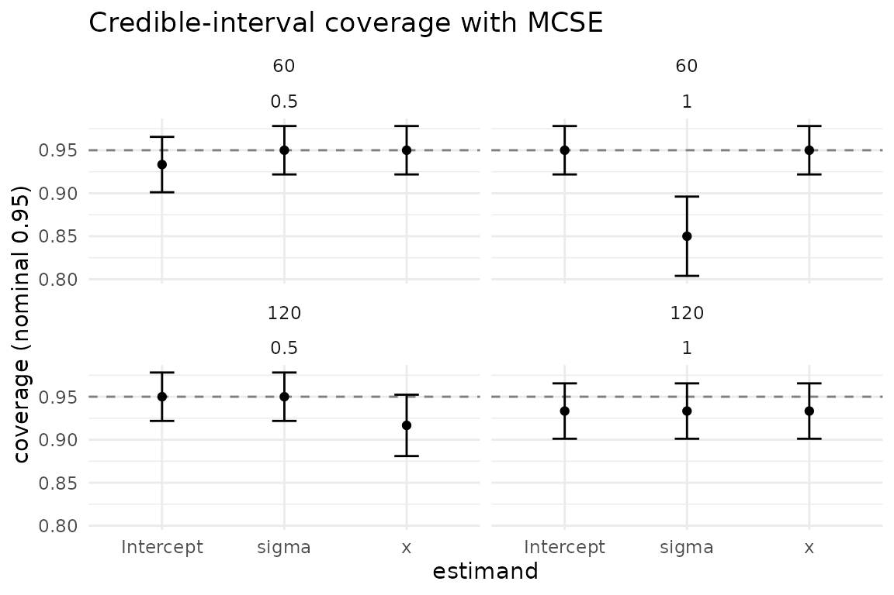
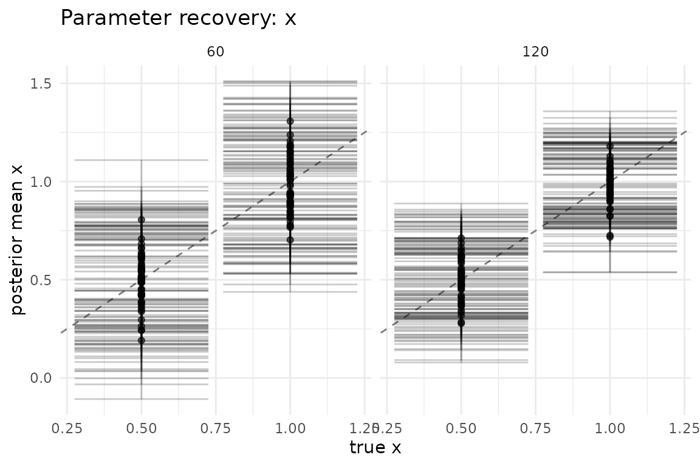

# Design of simulation studies

``` r

library(bayesim)
```

## Introduction

A simulation study is an experiment whose subjects are *datasets*
simulated from a known data-generating process (DGP), and whose
measurements are the *performance* of one or more estimators applied to
those datasets. Because the truth is known, simulation is the gold
standard for evaluating statistical methods — but only when the study
itself is well-designed and honestly reported.

This vignette follows the framework of Morris, White & Crowther (2019,
*Statistics in Medicine*), which structures a simulation study around
four questions:

1.  What are the **estimands** — the quantities we want the method to
    recover?
2.  What are the **data-generating mechanisms** — the DGPs that produce
    the simulated datasets, and how do they expose the estimands?
3.  What are the **performance measures** — bias, variance/SE, MSE,
    coverage, etc. — used to judge the method, and what is their Monte
    Carlo standard error (MCSE)?
4.  **How many replicates** are needed to estimate those performance
    measures to acceptable precision, and across which **varying
    conditions**?

bayesim provides typed primitives for each of these. This vignette runs
end-to-end with
[`LinearRegressionFitter()`](https://sims1253.github.io/bayesim/reference/LinearRegressionFitter.md)
(exact conjugate Bayesian linear regression, no Stan) so every chunk is
executable.

## Estimands and data-generating mechanisms

The **estimand** is the target of inference — the parameter whose value
the method is supposed to recover. In a simulation, the estimand is
known because *we* set it. bayesim records it automatically: any name in
a generator’s `true_params` vector becomes a `truth__<param>` column in
the per-task summary (see
[`vignette("getting-started")`](https://sims1253.github.io/bayesim/articles/getting-started.md)),
and that column is what the analysis layer pairs against the per-task
posterior estimate.

The **data-generating mechanism** is the function that turns a parameter
setting into a dataset. bayesim generators have the signature
`(data_spec, task_ctx) -> data_bundle` and must consume the ambient RNG
state (the engine restores a per-task L’Ecuyer stream before each call;
do not re-seed inside). The factory constructors
[`fixed_truth_generator()`](https://sims1253.github.io/bayesim/reference/fixed_truth_generator.md),
[`prior_predictive_generator()`](https://sims1253.github.io/bayesim/reference/prior_predictive_generator.md),
and
[`ifs_generator()`](https://sims1253.github.io/bayesim/reference/ifs_generator.md)
cover common patterns; for everything else, write an inline generator
like the one below.

``` r

# A linear-regression DGP. The estimands (Intercept, slope x, sigma) are
# recorded as true_params; bayesim surfaces them as truth__* columns.
linear_dgp <- function(data_spec, task_ctx) {
  n <- data_spec$n
  beta <- data_spec$beta
  x <- stats::rnorm(n)
  y <- 1 + beta * x + stats::rnorm(n)
  list(
    train = data.frame(y = y, x = x),
    test = NULL,
    response = "y",
    true_params = c(Intercept = 1, x = beta, sigma = 1),
    vars_of_interest = c("Intercept", "x", "sigma")
  )
}
```

The `data_grid` is the table of `data_spec` rows swept over. Each row is
one data-generating condition; each condition is replicated
`n_replicates` times.

## Performance measures

The performance measures of Morris et al. (2019) characterise an
estimator across replicate datasets:

- **bias** — does the estimator hit the truth on average?
- **empirical SE (emp_se)** — how variable is the estimator across
  datasets?
- **MSE** — mean squared error, the combined bias-plus-variance.
- **coverage** — does the nominal interval contain the truth at the
  nominal rate?
- **model SE (model_se)** — the average uncertainty the *method itself*
  reports (compare to the empirical SE to check the method’s uncertainty
  calibration).

Each of these is a Monte Carlo estimate from `n` replicates, so each
carries an **MCSE** — the simulation’s own standard error. Reporting a
performance estimate without its MCSE is like reporting a sample mean
without a standard error: the reader cannot tell signal from noise.
bayesim computes every MCSE for you.

Run a small study and call
[`performance_measures()`](https://sims1253.github.io/bayesim/reference/performance_measures.md):

``` r

config <- simulation_config(
  data_grid = data.frame(n = 100L, beta = 0.5),
  fit_grid = data.frame(model = "lm"),
  data_generator = linear_dgp,
  fitter = LinearRegressionFitter(n_draws = 400L),
  metrics = list(posterior_summary_metric()),
  n_replicates = 80L,
  seed = 11L
)

result <- run_simulation(config, progress = FALSE)
#> 80 tasks = 1 data x 1 fit x 80 reps
#> ℹ Starting simulation with 80 tasks
#> 
#> ✔ Simulation complete: 80/80 tasks succeeded in 0.6s

pm <- performance_measures(result, estimand = "x")
pm
#> # A tibble: 6 × 9
#>   data_n data_beta fit_model estimand measure    value     mcse n_sim truth_mode
#>    <int>     <dbl> <chr>     <chr>    <chr>      <dbl>    <dbl> <int> <chr>     
#> 1    100       0.5 lm        x        bias     -0.0211  1.22e-2    80 fixed     
#> 2    100       0.5 lm        x        emp_se    0.110   8.71e-3    80 fixed     
#> 3    100       0.5 lm        x        mse       0.0123  2.11e-3    80 fixed     
#> 4    100       0.5 lm        x        model_se  0.0979  9.96e-4    80 fixed     
#> 5    100       0.5 lm        x        coverage  0.938   2.71e-2    80 fixed     
#> 6    100       0.5 lm        x        n_sim    80      NA          80 fixed
```

The tidy tibble has one row per `estimand x measure`, with the `value`
and its `mcse`. For the conjugate fitter on this DGP we expect: bias
near zero, emp_se and model_se close to each other (the posterior
correctly reports its own uncertainty), and coverage near the nominal
0.95.

The MCSE formulas follow Morris et al. / rsimsum: bias MCSE =
`sd / sqrt(n)`; emp_se MCSE = `sd / sqrt(2(n-1))`; MSE MCSE via the
delta method on the squared errors; coverage MCSE = `sqrt(p(1-p) / n)`;
model_se MCSE = `sd(posterior_sd) / sqrt(n)`. These are exactly the
formulas inverted by
[`n_replicates_for_target()`](https://sims1253.github.io/bayesim/reference/n_replicates_for_target.md)
below.

## How many replicates?

The MCSE shrinks as `1/sqrt(n)`, so the number of replicates is a
precision budget.
[`n_replicates_for_target()`](https://sims1253.github.io/bayesim/reference/n_replicates_for_target.md)
inverts the MCSE formulas to tell you how many replicates you need to
hit a target MCSE *before* you run the study — a power calculation for
simulation.

For coverage, the MCSE is `sqrt(p(1-p) / n)`, maximised at `p = 0.5`
(the conservative default). Inverting gives `n = p(1-p) / MCSE^2`.

``` r

# Target: coverage MCSE of 0.03 at the conservative p = 0.5.
n_replicates_for_target(target_mcse = 0.03, metric_type = "coverage")
#> [1] 278
```

So **278** replicates (ceiling) are needed to estimate a coverage rate
to within `+/- 0.03` (one MCSE) at the worst-case variance. If the
coverage is expected near the nominal 0.95, supply `p = 0.95` for a
tighter, smaller estimate:

``` r

n_replicates_for_target(target_mcse = 0.03, metric_type = "coverage", p = 0.95)
#> [1] 53
```

For a continuous measure (bias, model SE), the MCSE is `sd / sqrt(n)`,
so you must supply an assumed standard deviation for the per-replicate
point estimate (e.g. a guess at the empirical SE of the estimator,
perhaps from a pilot run):

``` r

# Target bias MCSE of 0.05, assuming the point estimate has sd ~ 0.5.
n_replicates_for_target(
  target_mcse = 0.05, metric_type = "continuous", assumed_sd = 0.5
)
#> [1] 100
```

Use these numbers to size the study up front: a coverage claim with 50
replicates and MCSE 0.07 is barely more precise than a coin flip, while
1,000+ replicates give MCSEs near 0.015 — the difference between a
defensible simulation and an anecdotal one.

## Varying conditions

A simulation study that varies nothing proves nothing about the *range*
of behaviour a method exhibits. The Morris et al. framework emphasises
sweeping over the factors that plausibly change performance: sample
size, effect size, noise level, model mis-specification, etc. In
bayesim, varying conditions are just additional rows in the `data_grid`
(or columns swept within it); the analysis layer’s `by` argument then
groups the performance measures by condition.

Below we vary sample size and effect size together:

``` r

design_config <- simulation_config(
  data_grid = data.frame(
    n = c(60, 60, 120, 120),
    beta = c(0.5, 1.0, 0.5, 1.0)
  ),
  fit_grid = data.frame(model = "lm"),
  data_generator = linear_dgp,
  fitter = LinearRegressionFitter(n_draws = 400L),
  metrics = list(posterior_summary_metric()),
  n_replicates = 60L,
  seed = 23L
)

design_result <- run_simulation(design_config, progress = FALSE)
#> 240 tasks = 4 data x 1 fit x 60 reps
#> ℹ Starting simulation with 240 tasks
#> 
#> ✔ Simulation complete: 240/240 tasks succeeded in 1.1s
```

Group the performance measures by both conditions with the `by`
argument. The `data_grid` columns surface in the summary with a `data_`
prefix, so we group by `data_n` and `data_beta`:

``` r

pm_design <- performance_measures(
  design_result, estimand = "x", by = c("data_n", "data_beta")
)
pm_design
#> # A tibble: 24 × 8
#>    data_n data_beta estimand measure     value     mcse n_sim truth_mode
#>     <dbl>     <dbl> <chr>    <chr>       <dbl>    <dbl> <int> <chr>     
#>  1     60       0.5 x        bias     -0.00245  0.0158     60 fixed     
#>  2     60       0.5 x        emp_se    0.122    0.0112     60 fixed     
#>  3     60       0.5 x        mse       0.0147   0.00279    60 fixed     
#>  4     60       0.5 x        model_se  0.130    0.00205    60 fixed     
#>  5     60       0.5 x        coverage  0.95     0.0281     60 fixed     
#>  6     60       0.5 x        n_sim    60       NA          60 fixed     
#>  7     60       1   x        bias     -0.0164   0.0177     60 fixed     
#>  8     60       1   x        emp_se    0.137    0.0126     60 fixed     
#>  9     60       1   x        mse       0.0187   0.00264    60 fixed     
#> 10     60       1   x        model_se  0.126    0.00230    60 fixed     
#> # ℹ 14 more rows
```

Read each row as one condition cell. As `n` grows, the empirical SE and
MSE should shrink (more data, tighter inference); as `beta` grows the
signal strengthens. Coverage should stay near 0.95 throughout for the
conjugate fitter. The MCSE column tells you how much trust to put in
each cell at 60 replicates — a reminder that small condition x condition
grids with few replicates produce noisy performance estimates.

Plotting coverage across conditions gives the visual version of the
coverage rows.
[`plot_coverage()`](https://sims1253.github.io/bayesim/reference/plot_coverage.md)
plots each condition x estimand cell as a point with MCSE error bars
against the nominal rate:

``` r

plot_coverage(design_result, by = c("data_n", "data_beta"))
```



For a fuller picture,
[`plot_recovery()`](https://sims1253.github.io/bayesim/reference/plot_recovery.md)
shows per-task posterior-mean estimates against the truth, faceted by a
condition column — a direct visual check that the estimator recovers the
estimand across the design:

``` r

plot_recovery(design_result, estimand = "x", by = "data_n")
```



The parameter argument is named `estimand`, the same term
[`performance_measures()`](https://sims1253.github.io/bayesim/reference/performance_measures.md)
uses (`var =` remains accepted as a compatibility alias).

## Summary

The Morris et al. (2019) framework, in bayesim, maps to a small set of
typed primitives:

- **Estimands** are recorded by generators as `true_params` and surfaced
  as `truth__*` columns.
- **DGPs** are generators
  ([`fixed_truth_generator()`](https://sims1253.github.io/bayesim/reference/fixed_truth_generator.md),
  [`prior_predictive_generator()`](https://sims1253.github.io/bayesim/reference/prior_predictive_generator.md),
  [`ifs_generator()`](https://sims1253.github.io/bayesim/reference/ifs_generator.md),
  or an inline function).
- **Performance measures** with MCSEs come from
  [`performance_measures()`](https://sims1253.github.io/bayesim/reference/performance_measures.md).
- **Replicate sizing** comes from
  [`n_replicates_for_target()`](https://sims1253.github.io/bayesim/reference/n_replicates_for_target.md).
- **Varying conditions** are rows/columns of the `data_grid`, grouped in
  the analysis layer via `by`.

For the calibration-specific counterpart to performance coverage —
checking the *whole* posterior for self-consistency rather than a single
interval — see
[`vignette("sbc-and-calibration")`](https://sims1253.github.io/bayesim/articles/sbc-and-calibration.md).

## Reference

Morris, White & Crowther (2019), *Using simulation studies to evaluate
statistical methods*, Statistics in Medicine 38(11): 2074-2102.
